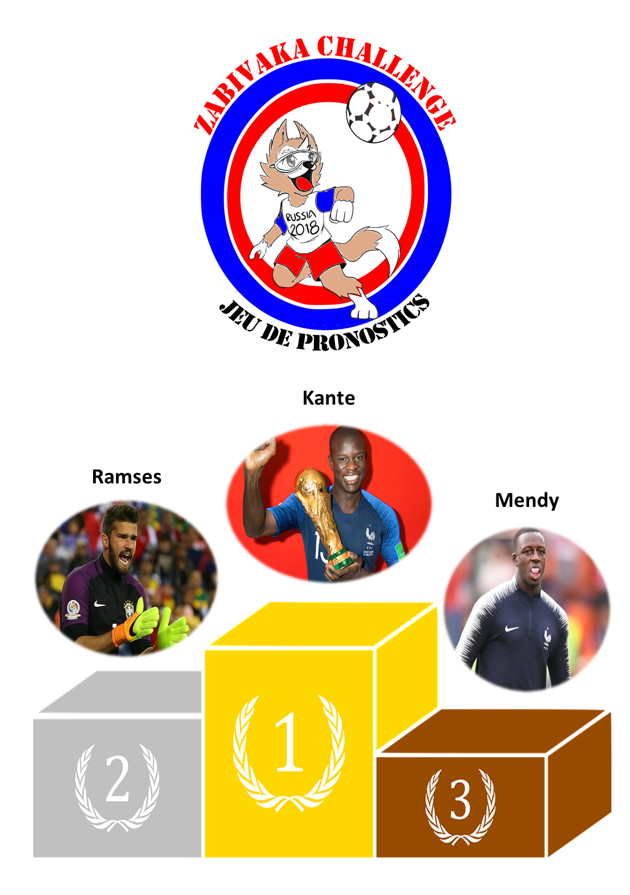

```{r setup, include=FALSE,message=FALSE, warning = FALSE}
knitr::opts_chunk$set(echo = FALSE, message=FALSE, warning = FALSE)
library(ggthemes) ; library(circlepackeR) ; library(Hmisc) ; library(tidyverse) ; library(echarts4r) ; library(magrittr) ; library(data.tree) ; library(flexdashboard) ; library(lubridate) ; suppressPackageStartupMessages(library(googleVis)) ; library(ggpubr) ; library(echarts4r) ; library(gganimate) ; library(ggpubr) ; library(tweenr) ; library(viridis) ; library(magick) ; library(animation) ; library(slickR) ; library(svglite) ; library(htmlwidgets) ; library(plotly)  ; library(formattable) ; library(kableExtra) ; library(anicon) ; library(rAmCharts) ; library(pipeR) ;
#########################################
load("data/sorties_tables/sortie.Rdata")
classement_fifa<-read.csv2("data/ClassementFifa.csv")
rep_fig = "img/figures/"
```


## Bravo aux vainqueurs !



<br>

## Quel est votre classement ?


